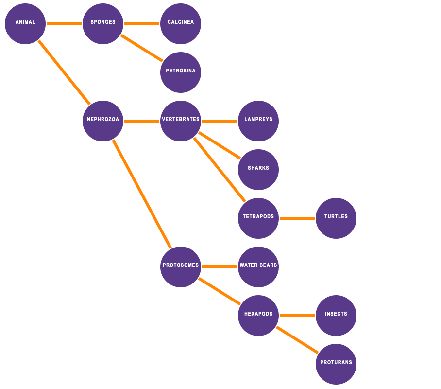
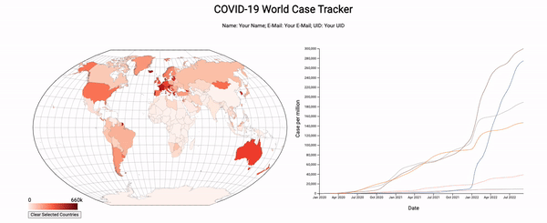
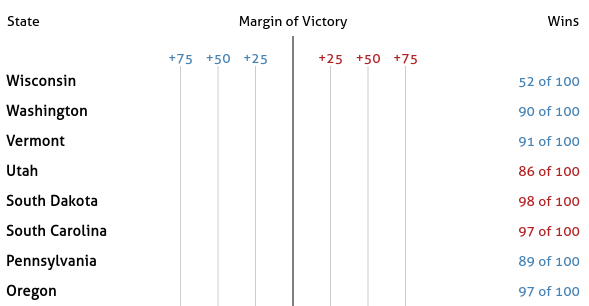
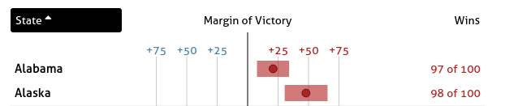
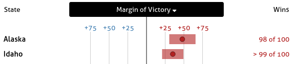
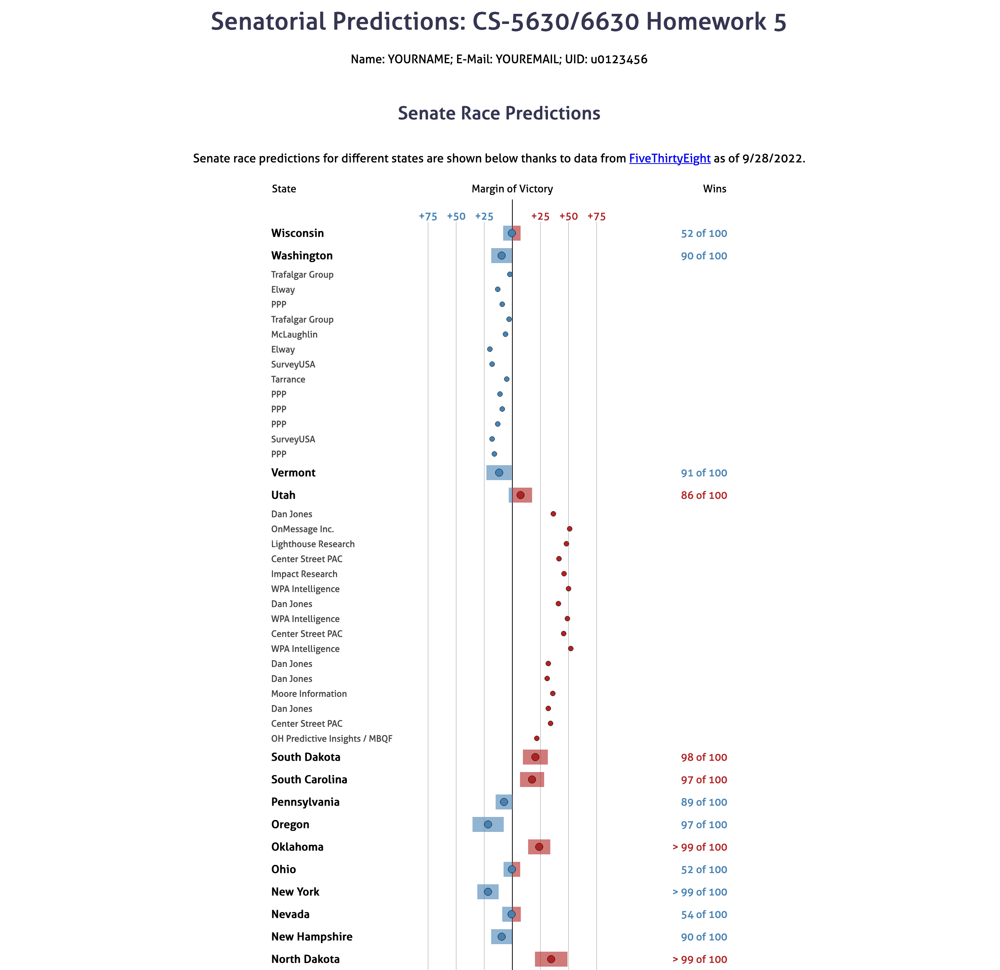

# DataVis-Fall-22

This repo contains all the assignments of data visualization course. Till now all the assignments are done perfectly.

## Project 2
In this project, I used JavaScript to create a tree data structure, and render that tree to the browser with the D3 library. The final tree of this project looked like following:

Details of this project will be found inside `HW2`

## Project 3 
In this project, I made interactive charts with JavaScript and D3 to explored Covid-19 data. The final result of this project looks like following,

I animated the charts using D3, after adding the animation it interacted like followingr,

Details of this project will be found inside `HW3`

## Project 4
In this project, I built a visualization inspired by [OurWorldInData's](https://ourworldindata.org/covid-cases) COVID-19 dashboard. The visualization is made up of two views: a map and a interactive line chart based on the selected countries in map.
Here is the final visualization showing the interaction between the world map and line chart,

**Part 1: Map View**

**Part 2: Line chart**

Details of this project will be found inside `HW4`.

## Project 5
In this project, I visualized polling data and predictions for the upcoming US senate election. The final solution looks like following,

There are 7 parts in this project as described following,

**Part I: Populating The table**

**Part II: Legend**

**Part III: Added Gridlines**

**Part IV: Added Bars**

**Part V: Added Dots**

**Part VI: Updated Headers Based on Sorting**

Values are being sorted in increasing order by state name,

Again, the table is sorted in decreasing order by the margin of victory,

**Part VII: Polling contributions**

Details of this project will be found inside `HW5`.

